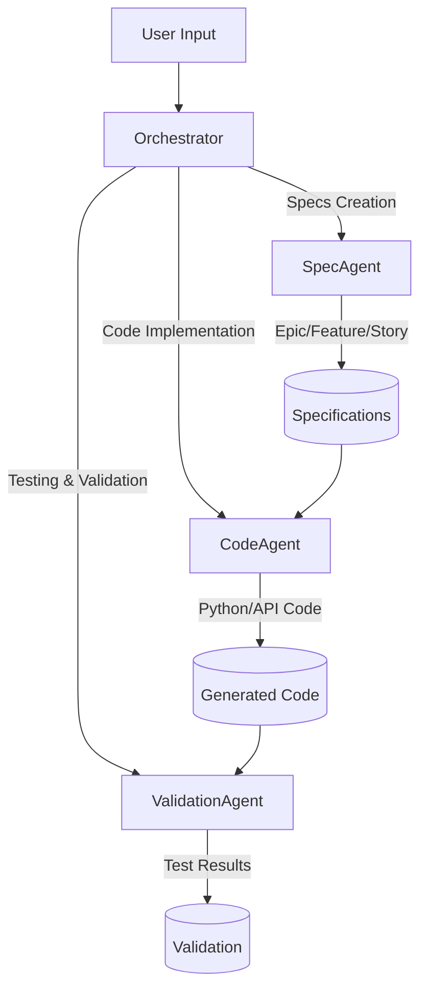

# PromptToProduct: Unified Banking Agent System

> **A comprehensive LangGraph-powered agentic orchestration system for banking domain development with intelligent prompt-to-product workflows.**

🏦 **Banking Domain Intelligence** | 🤖 **Multi-Agent Orchestration** | 📋 **Spec-Driven Development** | 🔄 **Complete Automation**

---

## 🌟 Overview

PromptToProduct is an advanced agentic orchestration system that transforms natural language prompts into complete banking specifications and production-ready code. Built on LangGraph with intelligent routing, the system enforces spec-driven development and provides comprehensive banking domain intelligence.

### 🎯 Core Value Proposition
- **Intelligent Routing**: Automatically directs prompts to appropriate agents based on intent and domain
- **Spec-Driven Development**: Enforces specification creation before code implementation 
- **Banking Domain Intelligence**: Built-in understanding of banking products, compliance, and workflows
- **Complete Automation**: End-to-end workflow from prompt to validated specifications and code
- **Multi-Agent Coordination**: Seamless collaboration between SpecAgent, CodeAgent, and ValidationAgent

### 🏗️ System Architecture



## 🚀 Quick Start

### Prerequisites
```powershell
# Python 3.8+
python --version

# Install dependencies
pip install -r requirements.txt
```

### Installation & Setup
```powershell
# Clone and navigate
git clone <repository-url>
cd PromptToProduct-1

# Install requirements
pip install -r requirements.txt

# Configure environment (optional)
# Add GitHub token for enhanced capabilities
$env:GITHUB_TOKEN = "your_github_token_here"
```

### Basic Usage

#### 1. Simple Prompt Execution
```python
from prompttoproduct import PromptToProductSystem

# Initialize system
system = PromptToProductSystem()

# Direct prompt processing
result = system.process("Create an epic for digital loan origination platform")
print(result)
```

#### 2. Interactive CLI Mode
```powershell
python prompttoproduct.py
```

#### 3. Programmatic Integration
```python
# Advanced usage with state management
system = PromptToProductSystem()
state = {
    "prompt": "Build a fraud detection API with real-time monitoring",
    "context": {"domain": "banking", "compliance": ["PCI-DSS", "AML"]}
}

result = system.execute_workflow(state)
```

### Example Prompts

#### Epic Creation
```
"Create an epic for digital loan origination platform with AI-powered risk assessment"
```

#### Feature Development
```
"Add a feature for real-time fraud detection in credit card transactions under epic E001"
```

#### Code Implementation
```
"Implement REST API for loan application submission with validation"
```

#### Complete Workflow
```
"Create specifications and implement digital banking platform with mobile app"
```

## 🏗️ System Components

### 🎭 Multi-Agent Architecture

#### 1. **Orchestrator Agent** 
- **Purpose**: Central coordination and intelligent routing
- **Capabilities**: 
  - Prompt intent classification
  - Agent routing and workflow management
  - State coordination across agents
  - Banking domain detection and routing
- **Key Features**:
  - Spec-driven development enforcement
  - Intelligent workflow state management
  - Error handling and recovery
  - Cross-agent communication

#### 2. **SpecAgent** (Requirements & Architecture)
- **Purpose**: Creates comprehensive banking specifications
- **Outputs**: 
  - Epic specifications (high-level initiatives)
  - Feature specifications (product capabilities)
  - User stories (implementation tasks)
  - Compliance requirements
- **Banking Intelligence**:
  - Product type detection (loans, payments, cards)
  - Compliance requirement mapping
  - Regulatory framework integration
  - Risk assessment considerations

#### 3. **CodeAgent** (Implementation & Development)
- **Purpose**: Generates production-ready banking code
- **Capabilities**:
  - RESTful API development
  - Database schema generation
  - Frontend component creation
  - Integration layer implementation
- **Banking Specializations**:
  - Payment processing systems
  - Fraud detection algorithms
  - Compliance validation logic
  - Risk calculation engines
  - KYC/AML implementation

#### 4. **ValidationAgent** (Testing & Quality Assurance)
- **Purpose**: Comprehensive testing and validation
- **Outputs**:
  - Unit test suites
  - Integration test scenarios
  - Security validation tests
  - Performance benchmarks
- **Banking Focus**:
  - Compliance testing (PCI-DSS, SOX, etc.)
  - Security vulnerability assessment
  - Performance under banking loads
  - Regulatory requirement validation

### 🧠 LangGraph Orchestration

The system uses LangGraph for sophisticated workflow management:

#### Workflow States
```python
class PromptToProductState(TypedDict):
    prompt: str
    response: str 
    agent_responses: Dict[str, Any]
    banking_context: Dict[str, Any]
    specs_created: bool
    code_generated: bool
    validation_complete: bool
```

#### Intelligent Routing Logic
- **Intent Classification**: Automatically determines prompt purpose
- **Domain Detection**: Identifies banking products and compliance needs
- **Spec-Driven Enforcement**: Ensures specifications exist before code generation
- **Error Recovery**: Handles failures and provides alternative routing

#### State Management
- **Persistent Context**: Maintains conversation state across interactions
- **Cross-Agent Communication**: Shares context between agents
- **Progress Tracking**: Monitors workflow completion status

## 🏦 Banking Domain Intelligence

### 📊 Supported Product Types
- **Loans**: Mortgage, personal, auto, business loans
- **Credit Cards**: Rewards, secured, corporate cards
- **Payments**: Wire transfers, ACH, mobile payments, P2P
- **Investments**: Portfolio management, trading, robo-advisors
- **Accounts**: Savings, checking, certificates of deposit
- **Digital Banking**: Mobile apps, online platforms, APIs

### 🔒 Compliance Framework
- **Regulatory**: KYC, AML, SOX, GDPR, PCI-DSS, Basel III
- **Security**: Encryption, tokenization, fraud detection
- **Risk Management**: Credit risk, operational risk, stress testing

### 🎯 Domain-Specific Routing
The system automatically detects banking domains and routes to appropriate agents:

```python
def detect_banking_domain(prompt: str) -> Dict[str, Any]:
    """Intelligent banking domain detection"""
    domains = {
        'loans': ['loan', 'mortgage', 'lending', 'underwriting'],
        'payments': ['payment', 'transfer', 'ACH', 'wire'],
        'fraud': ['fraud', 'detection', 'suspicious', 'anomaly'],
        'compliance': ['KYC', 'AML', 'PCI', 'SOX', 'GDPR']
    }
    # Advanced NLP-based domain classification
```

## 📋 Spec-Driven Development Framework

### 🔄 Workflow Enforcement
The system enforces a specification-first approach:

1. **Specification Check**: Before any code generation, system verifies relevant specifications exist
2. **Automatic Spec Creation**: If specs missing, routes to SpecAgent first
3. **Spec-Driven Implementation**: CodeAgent uses specifications as blueprints
4. **Validation Alignment**: ValidationAgent tests against specifications

### 📝 Specification Hierarchy
```
Epic (E001) - High-level business initiative
├── Feature (F001) - Specific product capability
│   ├── Story (S001) - Implementation task
│   ├── Story (S002) - Integration task
│   └── Compliance (C001) - Regulatory requirement
└── Feature (F002) - Additional capability
    ├── Story (S003) - API development
    └── Story (S004) - Testing requirements
```

### ✅ Benefits of Spec-Driven Development
- **Consistency**: All code aligns with documented requirements
- **Traceability**: Clear mapping from requirements to implementation
- **Quality**: Reduces implementation errors and misalignment
- **Compliance**: Ensures regulatory requirements are addressed
- **Maintainability**: Makes code changes more predictable and safe

## 📚 Comprehensive Prompts Library

### 📁 Library Structure
```
prompts/
├── banking/                     # Banking domain prompts
│   ├── epics.md                # Epic-level prompts
│   ├── features.md             # Feature-level prompts  
│   ├── stories.md              # Story-level prompts
│   ├── compliance.md           # Compliance-focused prompts
│   ├── code_implementation.md  # Code generation prompts
│   └── workflows.md            # Complete workflow prompts
├── system/                      # System management prompts
│   ├── status.md               # Status and monitoring prompts
│   ├── validation.md           # Validation and testing prompts
│   └── orchestration.md        # LangGraph orchestration prompts
└── examples/                    # Complete workflow examples
    ├── credit_cards.md         # Credit card system examples
    └── fraud_detection.md      # Fraud detection examples
```

### 🎯 Prompt Categories

#### **Epic Prompts** (High-Level Initiatives)
```
"Create an epic for digital loan origination platform"
"Add an epic for mobile banking app modernization"
```

#### **Feature Prompts** (Product Capabilities)
```
"Add a feature for real-time fraud detection under epic E001"
"Create a feature for automated credit scoring with AI"
```

#### **Story Prompts** (Implementation Tasks)
```
"Create a story for KYC document verification API under feature F005"
"Add a story for payment gateway integration under feature F003"
```

#### **Code Implementation Prompts**
```
"Implement REST API for loan application submission with validation"
"Generate fraud detection algorithm with real-time monitoring"
```

#### **Complete Workflow Prompts**
```
"Create specifications and implement digital banking platform with mobile app"
"Orchestrate complete development of fraud detection system with compliance validation"
```

### ⚡ Quick Prompt Patterns

#### Basic Pattern Structure
```
Action + Subject + Context + Constraints

Examples:
"Create a feature for fraud detection under epic E001"
"Add a compliance story for PCI DSS under feature F002"
"Build a loan origination system with AI risk assessment"
```

#### Banking-Specific Patterns
```
Product Type + Process + Technology + Compliance

Examples:
"Create a credit card application system with fraud detection and PCI compliance"
"Build a loan underwriting platform with AI scoring and regulatory reporting"
"Add a payment processing feature with real-time monitoring and AML validation"
```

## 💻 Generated Code Structure

### 📁 Code Organization
```
code/
├── MyBank/                     # Banking domain implementations
│   ├── loan_origination/       # Loan processing systems
│   ├── payment_gateway/        # Payment processing
│   ├── fraud_detection/        # Security systems
│   └── compliance/             # Regulatory modules
├── samples/                    # Code samples and examples
├── tests/                      # Generated test files
│   ├── unit/                   # Unit tests
│   ├── integration/            # Integration tests
│   └── compliance/             # Compliance validation tests
└── docs/                       # Code documentation
    ├── api/                    # API documentation
    └── architecture/           # System design docs
```

### 🛠️ Code Generation Features

#### **RESTful API Development**
- Automatic endpoint generation
- Request/response validation
- Error handling and logging
- Rate limiting and throttling

#### **Database Integration**
- Schema generation and migration
- ORM model creation
- Connection pooling and optimization
- Data validation and constraints

#### **Security Implementation**
- Authentication and authorization
- Encryption and tokenization
- Audit logging and monitoring
- Compliance validation hooks

#### **Testing Automation**
- Comprehensive test suite generation
- Mock data and fixtures
- Performance and load testing
- Security and compliance testing

## 🔧 Configuration & Customization

### Environment Configuration
```python
# config.py
BANKING_DOMAINS = {
    'loans': {
        'compliance': ['KYC', 'AML', 'Basel III'],
        'risk_factors': ['credit_score', 'income', 'debt_ratio'],
        'workflow': ['application', 'underwriting', 'approval', 'disbursement']
    },
    'payments': {
        'compliance': ['PCI-DSS', 'AML', 'OFAC'],
        'security': ['encryption', 'tokenization', 'fraud_detection'],
        'workflow': ['initiation', 'validation', 'processing', 'settlement']
    }
}

AGENT_CONFIG = {
    'spec_agent': {
        'temperature': 0.1,  # Low for consistent specs
        'max_tokens': 2000,
        'banking_context': True
    },
    'code_agent': {
        'temperature': 0.2,  # Slightly higher for creative solutions
        'max_tokens': 3000,
        'include_tests': True,
        'security_focus': True
    }
}
```

### Custom Banking Domains
```python
# Add custom banking product
system.add_banking_domain(
    name="crypto_trading",
    compliance=["AML", "KYC", "SEC"],
    workflows=["onboarding", "trading", "settlement"],
    risk_factors=["volatility", "liquidity", "custody"]
)
```

### Agent Customization
```python
# Customize agent behavior
system.configure_agent(
    agent_type="code_agent",
    specialization="blockchain",
    frameworks=["web3.py", "ethereum"],
    security_level="maximum"
)
```

## 📊 Advanced Features

### 🔍 System Monitoring & Analytics

#### Real-time Status Monitoring
```python
# Check system status
status = system.get_status()
print(f"Active agents: {status['active_agents']}")
print(f"Specs created: {status['specs_count']}")
print(f"Code generated: {status['code_lines']}")
```

#### Performance Analytics
```python
# Workflow performance metrics
metrics = system.get_performance_metrics()
print(f"Average response time: {metrics['avg_response_time']}")
print(f"Success rate: {metrics['success_rate']}")
print(f"Most used domains: {metrics['top_domains']}")
```

### 🧪 Testing & Validation

#### Comprehensive Test Generation
```python
# Generate complete test suites
test_suite = system.generate_tests(
    scope="banking_platform",
    types=["unit", "integration", "compliance"],
    coverage_target=95
)
```

#### Compliance Validation
```python
# Validate compliance across all generated code
compliance_report = system.validate_compliance(
    standards=["PCI-DSS", "SOX", "GDPR"],
    scope="all_generated_code"
)
```

### 🔄 Workflow Orchestration

#### Custom Workflow Creation
```python
# Define custom banking workflow
workflow = system.create_workflow(
    name="loan_origination_complete",
    steps=[
        "create_epic",
        "define_features", 
        "implement_api",
        "generate_tests",
        "validate_compliance"
    ],
    parallel_execution=True
)
```

#### State Management
```python
# Advanced state management
state = system.create_state_manager(
    persistence=True,
    backup_interval=300,  # 5 minutes
    state_validation=True
)
```

## 🔗 Integration & API

### RESTful API Interface
```python
# API server for external integration
from flask import Flask, request, jsonify

app = Flask(__name__)
system = PromptToProductSystem()

@app.route('/process', methods=['POST'])
def process_prompt():
    prompt = request.json['prompt']
    result = system.process(prompt)
    return jsonify(result)

@app.route('/status', methods=['GET'])
def get_status():
    return jsonify(system.get_status())
```

### Webhook Integration
```python
# GitHub webhook integration
@app.route('/webhook/github', methods=['POST'])
def github_webhook():
    event = request.json
    if event['action'] == 'opened':
        # Auto-generate specs from PR description
        specs = system.generate_specs_from_pr(event['pull_request'])
        return jsonify(specs)
```

### CLI Tool
```bash
# Command-line interface
python prompttoproduct.py --prompt "Create loan API" --format json
python prompttoproduct.py --status --verbose
python prompttoproduct.py --validate --scope all
```

## 🎯 Example Workflows

### Complete Banking Platform Development
```python
# End-to-end banking platform creation
prompts = [
    "Create an epic for digital banking platform",
    "Add a feature for loan origination under epic E001",
    "Add a feature for payment processing under epic E001", 
    "Create a story for KYC verification under feature F001",
    "Implement loan application API with fraud detection",
    "Generate comprehensive test suite for all components",
    "Validate PCI compliance across all payment components"
]

for prompt in prompts:
    result = system.process(prompt)
    print(f"✅ {prompt} -> {result['status']}")
```

### Fraud Detection System
```python
# Comprehensive fraud detection implementation
workflow_state = {
    "prompt": "Build comprehensive fraud detection system",
    "requirements": {
        "real_time": True,
        "ml_models": ["isolation_forest", "neural_network"],
        "compliance": ["PCI-DSS", "AML"],
        "integration": ["payment_gateway", "transaction_monitoring"]
    }
}

result = system.execute_workflow(workflow_state)
```

## 📋 Dependencies

### Core Requirements
```txt
# Core framework
langgraph>=0.0.40
langchain>=0.1.0
langchain-openai>=0.0.8

# Data processing
pandas>=1.5.0
numpy>=1.24.0
sqlalchemy>=2.0.0

# API development
flask>=2.3.0
requests>=2.31.0
pydantic>=2.0.0

# Banking domain
python-banking>=1.0.0
compliance-checker>=0.5.0
fraud-detection>=0.3.0

# Testing
pytest>=7.4.0
pytest-cov>=4.1.0
unittest-mock>=1.0.0

# Development
black>=23.7.0
flake8>=6.0.0
mypy>=1.5.0
```

### Optional Enhancements
```txt
# GitHub integration
github-mcp-server>=0.2.0

# Advanced ML
scikit-learn>=1.3.0
tensorflow>=2.13.0

# Monitoring
prometheus-client>=0.17.0
grafana-api>=1.0.0

# Documentation
sphinx>=7.1.0
mkdocs>=1.5.0
```

## 🛠️ Development & Contributing

### Development Setup
```powershell
# Clone repository
git clone <repository-url>
cd PromptToProduct-1

# Create virtual environment
python -m venv venv
.\venv\Scripts\Activate.ps1

# Install development dependencies
pip install -r requirements.txt
pip install -r requirements-dev.txt

# Pre-commit hooks
pre-commit install
```

### Code Quality Standards
```powershell
# Code formatting
black prompttoproduct.py src/

# Linting
flake8 prompttoproduct.py src/

# Type checking
mypy prompttoproduct.py src/

# Testing
pytest tests/ --cov=src --cov-report=html
```

### Testing Strategy
```python
# Unit tests
pytest tests/unit/

# Integration tests
pytest tests/integration/

# Banking domain tests
pytest tests/banking/ --compliance

# End-to-end workflow tests
pytest tests/e2e/ --slow
```

## 🔒 Security & Compliance

### Security Features
- **Encryption**: All sensitive data encrypted at rest and in transit
- **Authentication**: Multi-factor authentication for system access
- **Authorization**: Role-based access control for different agents
- **Audit Logging**: Comprehensive logging of all system activities
- **Secure Communication**: TLS encryption for all API communications

### Compliance Standards
- **PCI-DSS**: Payment card industry compliance for payment processing
- **SOX**: Sarbanes-Oxley compliance for financial reporting
- **GDPR**: Data privacy compliance for customer data handling
- **AML/KYC**: Anti-money laundering and know-your-customer requirements
- **Basel III**: Banking regulatory compliance framework

### Security Configuration
```python
# Security settings
SECURITY_CONFIG = {
    'encryption': {
        'algorithm': 'AES-256',
        'key_rotation': 'weekly',
        'secure_storage': True
    },
    'authentication': {
        'mfa_required': True,
        'session_timeout': 1800,  # 30 minutes
        'password_policy': 'strong'
    },
    'audit': {
        'log_all_actions': True,
        'retention_period': '7_years',
        'real_time_monitoring': True
    }
}
```

## 📈 Performance & Scalability

### Performance Optimization
- **Caching**: Intelligent caching of specifications and generated code
- **Parallel Processing**: Multi-agent parallel execution where possible
- **Database Optimization**: Efficient database queries and indexing
- **Memory Management**: Optimized memory usage for large workflows

### Scalability Features
- **Horizontal Scaling**: Support for multiple agent instances
- **Load Balancing**: Distribution of requests across available agents
- **Queue Management**: Asynchronous processing for high-volume requests
- **Resource Monitoring**: Real-time monitoring of system resources

### Performance Metrics
```python
# Performance monitoring
metrics = {
    'response_times': {
        'spec_generation': '2-5 seconds',
        'code_generation': '5-15 seconds', 
        'validation': '3-8 seconds'
    },
    'throughput': {
        'specs_per_hour': 120,
        'code_files_per_hour': 80,
        'validations_per_hour': 200
    },
    'resource_usage': {
        'memory': '< 2GB',
        'cpu': '< 70%',
        'storage': 'minimal'
    }
}
```

## 🎓 Learning & Best Practices

### Best Practices for Prompts
1. **Be Specific**: Include domain context and compliance requirements
2. **Use Hierarchy**: Build epic → feature → story progressions
3. **Include Constraints**: Specify security, performance, and compliance needs
4. **Provide Context**: Reference existing specifications when building on them

### Banking Domain Guidelines
1. **Security First**: Always consider security implications
2. **Compliance Aware**: Include relevant regulatory requirements
3. **Risk Assessment**: Consider risk factors in all implementations
4. **Integration Focus**: Design for system integration and interoperability

### Code Quality Standards
1. **Documentation**: All generated code includes comprehensive documentation
2. **Testing**: Comprehensive test coverage for all generated code
3. **Security**: Security-first approach with built-in protections
4. **Maintainability**: Clean, readable, and maintainable code structure

## 🚨 Troubleshooting

### Common Issues
1. **Agent Routing Problems**: Check prompt clarity and domain context
2. **Specification Gaps**: Ensure all parent specifications exist
3. **Code Generation Errors**: Verify specification completeness
4. **Validation Failures**: Check compliance requirements alignment

### Debug Mode
```python
# Enable debug logging
import logging
logging.basicConfig(level=logging.DEBUG)

# Debug specific agent
system.enable_debug(agent='code_agent', verbose=True)

# Debug workflow state
system.debug_workflow_state(show_transitions=True)
```

### Support & Resources
- **Documentation**: Comprehensive guides in `docs/` directory
- **Examples**: Working examples in `examples/` directory  
- **Community**: GitHub discussions and issues
- **Support**: Enterprise support available for production deployments

---

## 📄 License

This project is licensed under the MIT License - see the LICENSE file for details.

## 🤝 Contributing

We welcome contributions! Please see CONTRIBUTING.md for guidelines on:
- Code style and standards
- Testing requirements
- Documentation standards
- Banking domain expertise
- Security considerations

## 📞 Support

- **Issues**: GitHub Issues for bug reports and feature requests
- **Discussions**: GitHub Discussions for questions and community support
- **Enterprise**: Contact for enterprise support and consulting

---

**Made with ❤️ for the Banking Industry | Powered by LangGraph & Advanced AI**